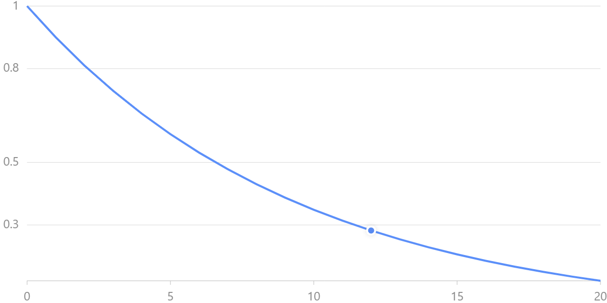
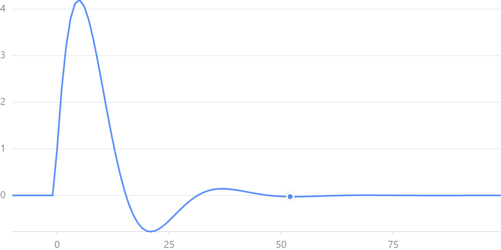
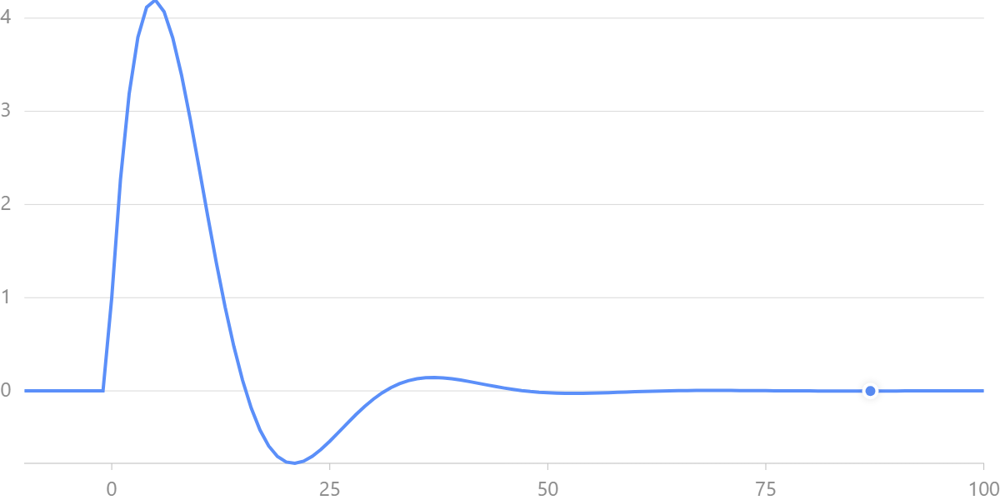

# [DSP Project of Chapter 2](https://toonnyy8.github.io/ncku/dsp2020/hw1/build/index.html)

### 1. x\[n\] = 0.9^n, 繪製出 0 <= n <= 20 的 x .
```typescript
const f = (n: number) => Math.pow(0.9, n)
```


### 2. y\[n\] = 1.8cos(pi/16)y\[n-1\] - 0.81y\[n-2\] + x\[n\] + 0.5x\[n-1\], 繪製出對應的系統( -10 <= n <= 101 ).

```typescript
// impulse function
const x = (n: number) => n == 0 ? 1 : 0
```

#### a. 用遞迴式
```typescript
const h = (x: (n: number) => number) => {
    // 利用 cache 減少計算量
    const cache: number[] = []
    const f = (n: number) => {
        // 如果 n < 0 的話就沒有能量，回傳 0
        if (n < 0) return 0
        // 如果發現已經有 cache，就回傳 cache 的值
        else if (cache[n] != undefined) return cache[n]
        // 如果沒有 cache，就依照公式計算、記錄到 cache 並回傳
        else return cache[n] =
            // 計算 f(n - 1) 的值
            1.8 * Math.cos(Math.PI / 16) * f(n - 1) -
            // 計算 f(n - 2) 的值
            0.81 * f(n - 2) +
            x(n) +
            (1 / 2) * x(n - 1)
    }
    return f
}

// 建立輸出函數
const f = h(x)
```


#### b. 用 filter
```typescript
/**
 * 
 * @param b b(i) = bi
 * @param a a(j) = aj and a(0) = 1
 * @param x 
 * 
 */
const filter = (
    b: (n: number) => number,
    a: (n: number) => number,
    x: (n: number) => number) => {
    // 檢查若 a(0) != 1 就報錯
    if (a(0) != 1) {
        console.error("a[0] must equal 1")
        return
    }
    // 利用 cache 減少計算量
    const cache: number[] = []

    /**
     * 
     * @param n 
     * 
     * @return  b0x[n] + b1x[n-1] + ... + bnx[0]
     *          - a1y[n-1] - a2y[n-2] - ... - any[0]
     */
    const f = (n: number) => {
        // 如果 n < 0 的話就沒有能量，回傳 0
        if (n < 0) return 0
        // 如果發現已經有 cache，就回傳 cache 的值
        else if (cache[n] != undefined) return cache[n]
        else {
            // 使用 matlab 的 filter 公式計算答案
            let out = 0
            for (let k = 0; k <= n; k++) {
                out += x(n - k) * b(k) -
                    f(n - (k + 1)) * a(k + 1)
            }
            cache[n] = out
            return out
        }
    }
    return f
}

// 將 array 轉成 function
const arr2fn = (arr: number[]) => {
    return (n: number) => {
        if (arr[n] != undefined) return arr[n]
        else return 0
    }
}

// 建立輸出函數
let f = filter(
    arr2fn([1, 1 / 2]),
    arr2fn([1, -1.8 * Math.cos(Math.PI / 16), 0.81]),
    x)
```

