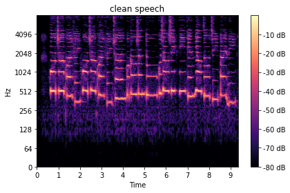
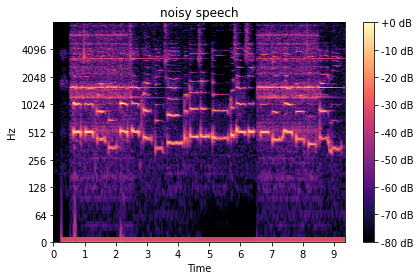
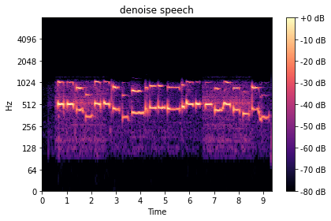
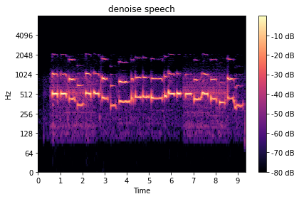

# [DSP Project of Chapter 7](https://colab.research.google.com/github/toonnyy8/ncku/blob/master/dsp2020/hw4/dsp2020-hw4.ipynb)

> Download the two audio signal files with a sampling rate of 16KHz (one is clean and the other is noisy) from the course Web site and process the signal as follows.
>
> 1. Show the spectrogram of the two audio signals
> 2. Remove the noise. You need to analyze the spectrum of the noise from the two audio files and design a filter to remove the noise.

-   乾淨的 spectrogram  
    

-   受污染的 spectrogram  
    

比較 clean 與 noisy 後可以發現噪音主要集中在 0\~100 Hz 與 1100\~8000 Hz 的區段，因此使用低通與高通濾波器將其濾除

```python
b1, a1 = scipy.signal.butter(8,(100),"highpass",False,"ba",16000)
denoise_speech = scipy.signal.filtfilt(b1, a1, noisy_speech)

b2, a2 = scipy.signal.butter(12,(1000),"lowpass",False,"ba",16000)
denoise_speech = scipy.signal.filtfilt(b2, a2, denoise_speech)
```

-   去噪後的 spectrogram  
    

但將高頻濾除後的聲音有種霧霧不清晰的感覺，因此使用 pitch shift 補上一個八度泛音，使其聽起來較為自然。

```python
# 將移除掉的諧波補回一些
denoise_speech_add_pitch_shift = denoise_speech + librosa.effects.pitch_shift(denoise_speech, 16000, n_steps=12) * 0.1
```

-   增加 pitch shift  
    
